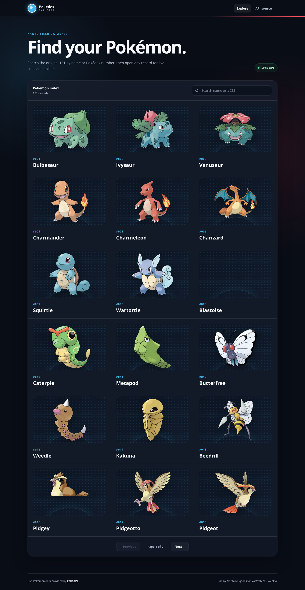

# Pokédex Explorer - VortexTech Week 4

A responsive React application that fetches and displays live Pokémon data from [PokéAPI](https://pokeapi.co/). This project was created for the final week of the VortexTech Web Development Internship Track.



## Live demo

The Vercel deployment link will be added here after the repository is connected to Vercel.

## Features

- Live data for the original 151 Pokémon
- Search by Pokémon name or Pokédex number
- Responsive card grid with pagination
- Dedicated detail route for every Pokémon
- Types, abilities, measurements, experience, and base stats
- Loading skeletons while API requests are running
- Friendly error messages with retry buttons
- Empty-search and 404 states
- Keyboard-accessible controls and responsive mobile layout

## Routes

| Route | Purpose |
| --- | --- |
| `/` | Browse, search, and paginate through the Pokémon list |
| `/pokemon/:pokemonName` | View live details for a selected Pokémon |
| `*` | Friendly page-not-found screen |

## Technology used

- React 19
- Vite 8
- React Router 7
- Fetch API
- PokéAPI
- Modern responsive CSS

## Run locally

1. Clone the repository.
2. Install the dependencies:

   ```bash
   npm install
   ```

3. Start the development server:

   ```bash
   npm run dev
   ```

4. Open the local URL shown in the terminal.

## Production build

```bash
npm run build
npm run preview
```

## Deployment

The project includes routing fallbacks for both Vercel (`vercel.json`) and Netlify (`public/_redirects`).

### Vercel

1. Push this project to a public GitHub repository named `vortextech-webdev-week4`.
2. In Vercel, choose **Add New > Project** and import the repository.
3. Keep the detected Vite settings and select **Deploy**.
4. Copy the live URL into the **Live demo** section above.

### Netlify

1. Import the GitHub repository in Netlify.
2. Use `npm run build` as the build command and `dist` as the publish directory.
3. Deploy and add the live link above.

## API reference

- List endpoint: `https://pokeapi.co/api/v2/pokemon?limit=151&offset=0`
- Detail endpoint: `https://pokeapi.co/api/v2/pokemon/{name}`

No API key or environment variable is required.

## Author

**Aleeza Muqadas**  
BS Information Technology, International Islamic University Islamabad
